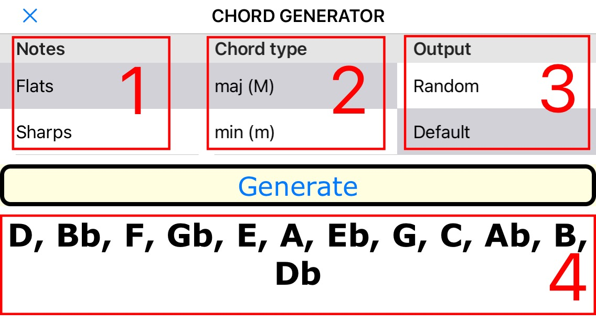

# Chord Generator

iOS, “Pythonista 3” application to generate random and circle of 4th/5th list of chords with different chord notation. 
Application is used with Jazz Piano School, Stage 0 - Laying The Foundation course to practice playing chord. 

## Usage

Select the following parameters

1. Notes: select set of note to use. 
    - b (flat): notes with flats and notes without accidentals. Notes will be randomized. 
    - \# (sharp): notes with sharps and notes without accidentals. Notes will be randomized. 
    - all: all notes. Notes will be randomized. 
    - Circle of 4th: notes will be displayed in strict order of circle of 4th. 
    - Circle of 5th: notes will be displayed in strict order of circle of 4th. 
2. Chord type: what type of chords to use. Multiple choice is possible. 
     - maj (M): major chord
     - min (m): minor chord
     - aug (+): augmented chord
     - dim (°): diminished chord
     - dom7 (7): dominant 7th chord
     - min7 (m7): minor 7th
     - maj7 (M7): major 7th
     - aug7 (+7)
     - aug7 (7aug5)
     - aug7 (7#5)
     - m7dim5 (°7)
     - m7dim5 (ø7)
     - m7dim5 (m7b5)
3. Chord output: what type of chord notation to use. 
     - Random: randomize chord notation display. Musthe notation is randomly substituted with all possible chord notation. For example: chord C major can be displayed as Cmaj, CM, C. C minor - Cm, Cmin, C-  
     - Default: most used notation is used. For example,  C for C major, Cm for C minor. 
     - MusThe: output that used in Musthe module. 
 
Then press “Generate” button. 

4. List of generated chords according to selected parameters. 

## Contributing

Pull requests are welcome. For major changes, please open an issue first to discuss what you would like to change.

## License

[MIT](https://choosealicense.com/licenses/mit/)