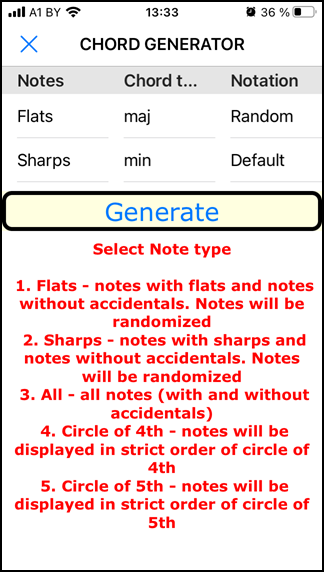
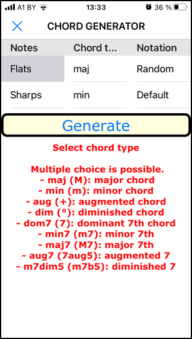
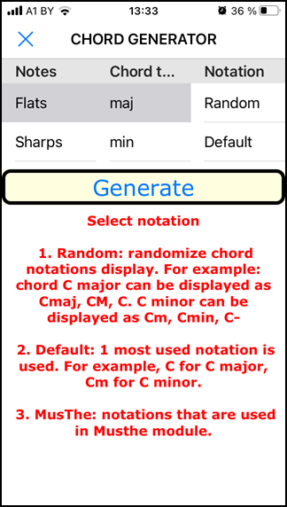

# Chord Generator with random notes and notations.

 

iOS, [“Pythonista 3”](http://omz-software.com/pythonista/) application to generate list of chords with random notes and circle of 4th/5th notes with random chord notations.
Application is used with [Jazz Piano School](https://jazzpianoschool.com/), "Stage 0 - Laying The Foundation" course to practice playing chords

## Usage

Select the following parameters

1. Notes: select set of note to use. 
    - b (flat): notes with flats and notes without accidentals. Notes will be randomized. 
    - \# (sharp): notes with sharps and notes without accidentals. Notes will be randomized. 
    - all: all notes. Notes will be randomized. 
    - Circle of 4th: notes will be displayed in strict order of circle of 4th. 
    - Circle of 5th: notes will be displayed in strict order of circle of 5th. 
2. Chord type: what type of chords to use. Multiple choice is possible. 
     - maj (M): major chord
     - min (m): minor chord
     - aug (+): augmented chord
     - dim (°): diminished chord
     - dom7 (7): dominant 7th chord
     - min7 (m7): minor 7th
     - maj7 (M7): major 7th
     - aug7 (7aug5): augmented 7
     - m7dim5 (m7b5): diminished 7
3. Notation: what type of chord notation to use. 
     - Random: randomize chord notations display. For example: chord **C major** can be displayed as Cmaj, CM, C. **C minor** can be displayed as Cm, Cmin, C-  
     - Default: 1 most used notation is used. For example, C for C major, Cm for C minor. 
     - MusThe: notations that are used in [Musthe](https://github.com/gciruelos/musthe) module. 
 
Then press “Generate” button. 

4. List of generated chords is displayed according to selected parameters. 

When no parameters are selected, but “Generate” button is pressed then help messages are showed.   

  

## Contributing

Pull requests are welcome. For major changes, please open an issue first to discuss what you would like to change.

## License

[MIT](https://choosealicense.com/licenses/mit/)
